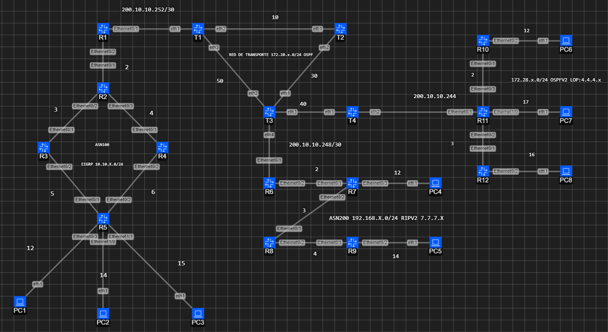

# Implementación de Red ISP: BGP + OSPF + MPLS (Simulación)




## 📋 Resumen del Proyecto
Proyecto de ingeniería telemática diseñado para simular el núcleo de un proveedor de servicios de internet (ISP). Se implementó una arquitectura híbrida utilizando **Cisco IOL** para el borde y **VyOS** para el transporte.

## 🛠️ Tecnologías Clave
* **Enrutamiento Dinámico:** BGP (eBGP/iBGP) para intercambio de rutas externas y OSPF para el IGP interno.
* **Orquestación:** Containerlab & Docker.
* **Optimización:** Ajuste de MTU y VRF para gestión fuera de banda (OOB).

## 🚀 Cómo desplegar este laboratorio
1. Clonar el repositorio:
   ```bash
   git clone [https://github.com/Jhon1176/BGP-OSPF-Telematics-Lab.git](https://github.com/Jhon1176/BGP-OSPF-Telematics-Lab.git)
